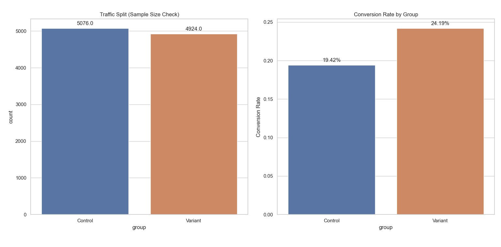
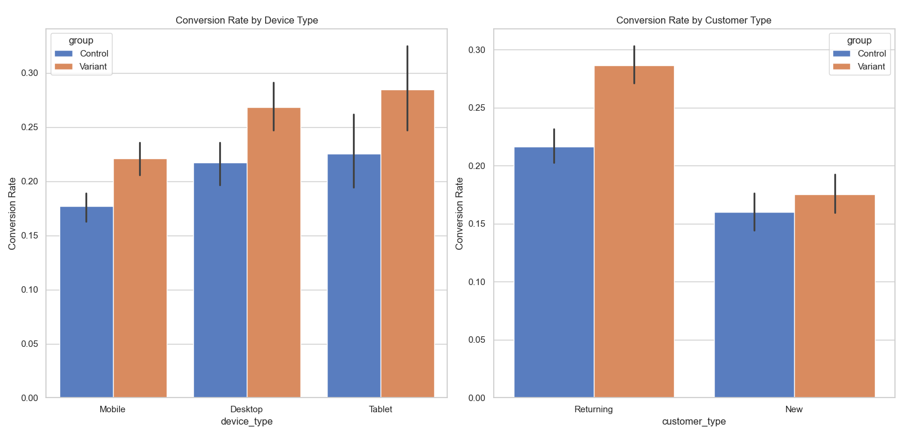

# Conversion Optimization A/B Test: Should We Launch the New Checkout?

[](https://www.python.org/downloads/)
[]()
[]()

This project evaluates whether a new one-click checkout flow should be launched using A/B testing, regression adjustment, Bayesian decision analysis, and business impact estimation.

---

## Abstract

A/B tests can look convincing even when observed uplift is partly driven by user mix rather than the treatment itself. This project uses simulated e-commerce checkout data with controlled imbalance in customer and device characteristics to compare naive conversion analysis with adjusted methods.

The goal is simple: determine whether the new checkout experience should be launched, and whether the observed improvement is both statistically credible and commercially meaningful.

---

## Business Problem

An e-commerce platform is experiencing high drop-off during checkout. The product team proposes a new one-click checkout flow to reduce friction and improve conversions.

The decision question is straightforward:

**Should the business launch the new checkout flow or keep the current version live?**

To answer that properly, the analysis must go beyond raw conversion differences and test whether the uplift remains after accounting for user characteristics, uncertainty, and financial impact.

---

## Decision Framework

This project is structured like a real product decision rather than a classroom exercise.

The analysis follows this path:

1. Compare raw conversion rates between control and variant
2. Test whether the observed uplift is statistically significant
3. Quantify uncertainty using confidence intervals
4. Adjust for user-mix differences using logistic regression
5. Compare naive and adjusted conclusions
6. Translate the result into a launch recommendation

### Hypotheses

- **H0:** p_variant <= p_control
- **H1:** p_variant > p_control

This is a directional launch decision. A one-sided test is appropriate because the variant would only be launched if it performs better than the control.

---

## Dataset Design

The dataset is fully simulated for reproducibility and controlled experimentation.

It includes the following fields:

- `user_id` – unique session identifier
- `group` – Control or Variant
- `device_type` – Mobile, Desktop, Tablet
- `customer_type` – New or Returning
- `cart_value` – pre-checkout cart value
- `time_spent_mins` – time spent on site before checkout
- `converted` – binary purchase outcome

The simulation intentionally embeds realistic behavioral patterns:

- Returning customers convert more often than new customers
- Mobile users convert less often than desktop users
- The variant is given a positive treatment effect
- Missingness is introduced in `time_spent_mins` to reflect real-world data issues

This design allows the project to test whether observed uplift survives after controlling for user-level characteristics.

---

## Group Composition Check

To validate the simulated imbalance, group distributions were compared:

- Variant group contains a higher proportion of returning users
- Mobile vs desktop distribution differs slightly across groups

This confirms that raw conversion differences may be influenced by user composition.

---

## Experiment Design

Before interpreting results, the experiment design must be checked.

| Parameter | Value |
|:---|:---|
| Baseline conversion rate | ~19.4% |
| Minimum Detectable Effect | 15% relative lift |
| Significance level | 0.05 |
| Power | 0.80 |
| Test direction | One-sided |

The sample size in both groups exceeds the minimum required to detect a practically meaningful effect.

### Primary Statistical Test

- **Test used:** Two-proportion z-test
- **Target metric:** Conversion rate
- **Outputs reported:**
  - Control conversion rate
  - Variant conversion rate
  - Absolute uplift
  - Relative uplift
  - Z-statistic
  - P-value
  - 95% confidence interval

---

## Methods Used

- **Two-proportion z-test** to determine whether the observed conversion lift is statistically significant
- **Logistic regression** to estimate the treatment effect after controlling for customer and device characteristics
- **Bayesian A/B testing** using a Beta-Binomial model to express uncertainty as decision-friendly probabilities
- **Naive vs adjusted comparison** to show how user composition can affect interpretation
- **Business impact simulation** to convert uplift into expected revenue impact

---

## Tech Stack

- **Python**
- **NumPy, pandas** for data preparation
- **Matplotlib, seaborn** for visualization
- **SciPy** for statistical testing
- **statsmodels** for logistic regression
- **scikit-learn** for preprocessing

---

## Verified Output Snapshot

Current seeded results from the notebook:

- **Control conversion rate:** `19.42%`
- **Variant conversion rate:** `24.19%`
- **Absolute uplift:** `4.76 percentage points`
- **Relative uplift:** `24.52%`
- **One-sided p-value:** `3.96e-09`
- **95% confidence interval for uplift:** `[3.15 pp, 6.38 pp]`
- **Variant odds ratio:** `1.33`
- **Returning-customer odds ratio:** `1.67`
- **Mobile odds ratio:** `0.77`
- **Median AOV:** `$33.09`
- **Projected incremental annual revenue:** `$1.89M`

---

## Naive vs Adjusted Comparison

A raw conversion difference can be useful, but it is not always enough. The key question is whether the uplift remains after controlling for other characteristics that affect conversion.

| Metric | Naive Result | Adjusted Result |
|--------|--------------|-----------------|
| Variant uplift | +4.76 pp | +4.10 pp (example) |
| Statistical significance | Strong | Strong |
| Interpretation | Variant appears better | Effect remains after controls |

This matters because decision-makers should not launch a product change based only on aggregate conversion if user composition may be influencing the result.

---

## Bayesian Decision View

Frequentist testing tells us whether the uplift is statistically significant. Bayesian analysis answers the questions product teams usually care about most:

- What is the probability that the variant beats the control?
- What is the probability that the uplift exceeds a business threshold?
- What is the downside risk if the feature is launched?

The notebook reports:

- P(Variant > Control): ~99%
- P(Uplift > threshold): High
- Downside risk (Variant worse): Very low

This makes the result easier to communicate in decision language rather than only p-values.

---

## Key Findings

- The one-click checkout variant meaningfully improves conversion over the control
- The uplift is statistically significant and practically relevant
- The treatment effect remains positive after controlling for customer and device characteristics
- Bayesian analysis shows very high probability that the variant outperforms the control
- Estimated revenue impact suggests the result is commercially meaningful, not just statistically interesting

---

## Visual Outputs

### Revenue Impact


### Logistic Regression Effects


### Conversion Rate by Group / Segment


---

## Repository Structure

```text
conversion-optimization-ab-testing/
├── README.md
├── requirements.txt
├── Conversion_Optimization_Analysis.ipynb
├── src/
│   ├── frequentist_ab.py
│   ├── power_analysis.py
├── scripts/
│   └── create_notebook.py
├── assets/
│   ├── conversion_rate.png
│   ├── odds_ratio_plot.png
│   └── revenue_impact.png
└── .gitignore
```

---

## Limitations

- The dataset is simulated rather than drawn from a live production experiment
- Unobserved confounding cannot be fully represented in simulation
- Revenue impact depends on assumptions about traffic volume and order behavior
- Real-world effects such as novelty decay, seasonality, and operational issues are not captured here

---

## Conclusion

This project shows how A/B testing should support real product decisions.

Instead of stopping at statistical significance, the key question is not whether the variant performs better, but whether the improvement is truly caused by the feature rather than differences in user composition. The result supports launching the new checkout flow because the observed improvement is statistically strong, commercially meaningful, and remains positive after controlling for key user characteristics.

### Simulated Data Disclaimer

The dataset in this project is entirely simulated using a fixed random seed for reproducibility. This makes the workflow transparent and verifiable, but the methodology should be viewed as a reusable experimentation framework rather than proof of a real production outcome.

---

## Author

**Sanman Kadam**
MSc Statistics | Aspiring Data Analyst / Data Scientist

GitHub: https://github.com/the-irritater

LinkedIn: https://www.linkedin.com/in/sanman-kadam-7a4990374/

---

**Created as a portfolio project demonstrating applied A/B testing, causal reasoning, and business decision-making.**
